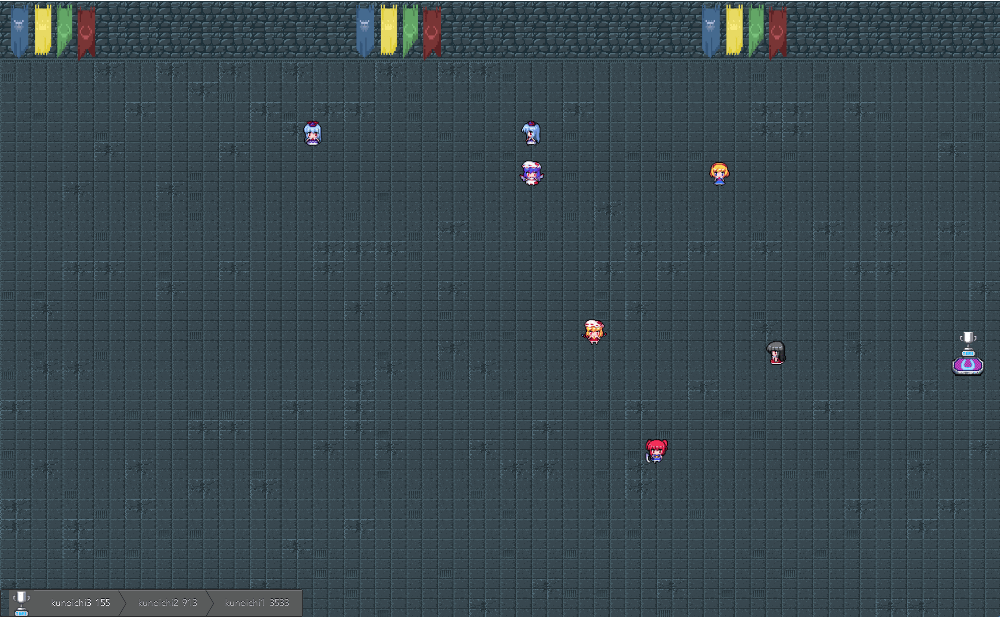

# Mazerunner



A websocket-based maze application.

Given a websocket endpoint, a websocket client can connect and navigate across the maze, in search for the trophy room. 

## Running

### Server

Like any other Maven-based application, build the project with:

```bash
$ ./mvnw install
```

This produces a jar file under `target/` directory, which you can also run as a standalone server:

```bash
$ cd target/
$ java -jar mazerunner-1.0.1.jar
```

Then access the maze at [localhost:8999/maze](localhost:8999/maze).

If you're using Docker, you can also spin up an instance with:

```bash
$ docker run -p 8999:8999 devcsrj/mazerunner:1.0.1
```

### Client

This project also provides various solutions to the maze, [written in Go](https://golang.org/).

```bash
$ cd solutions/
$ go run ./ --alg="pledge"
```

The start script also provides various flags:

* `--addr` (localhost:8999) - The server address
* `--id` (ninja) - The runner id
* `--name` (TOGO) - The runner name
* `--alg` (headless) - The algorithm to use: 
    * `dijkstra` - [Dijkstra](https://en.wikipedia.org/wiki/Dijkstra%27s_algorithm)
    * `headless` - [A*](https://en.wikipedia.org/wiki/A*_search_algorithm) with Random heuristics
    * `a*man` - [A*](https://en.wikipedia.org/wiki/A*_search_algorithm) + [Manhattan](https://en.wiktionary.org/wiki/Manhattan_distance)
    * `a*diag` - [A*](https://en.wikipedia.org/wiki/A*_search_algorithm) + [Diagonal](https://en.wikipedia.org/wiki/Chebyshev_distance)
    * `a*euc` - [A*](https://en.wikipedia.org/wiki/A*_search_algorithm) + [Euclidian](https://en.wikipedia.org/wiki/Euclidean_distance)
    * `pledge` - [Pledge](https://en.wikipedia.org/wiki/Maze_solving_algorithm#Pledge_algorithm)
    * `dfs` - [Depth-First Search](https://en.wikipedia.org/wiki/Depth-first_search)
* `--verbose` (true) - Whether to print the moves taken

You can also run all of the available solutions using the shell script:

```bash
$ cd solutions/
$ ./run_all.sh
```

### Mechanics

Clients can connect to the server by specifying the header `x-runner-tag`. Using 
[wscat](https://github.com/websockets/wscat), I can connect with:

```bash
$ wscat --header x-runner-tag:devcsrj:Reijhanniel --connect ws://localhost:8999/maze/move
```

Navigating around the maze is done by exchanging coordinates in the form of `(x,y)`:

```
> (-1,-1)
< (32,0)[(32,1)]
```

Sending `(-1,-1)` as coordinates sends the current position. In the above response, 
`(32,0)` is the current position, while `(32,1)` is the neighboring room. Sending 
`(32,1)` moves the runner to the next room:

```
> (32,1)
< (32,1)[(32,0),(32,2)]
```

The goal is to reach the room containing the trophy, determined at [localhost:8999/maze/goal](localhost:8999/maze/goal).

Moving to a coordinate unreachable from the current position disconnects the runner.

## Developing

The server side is based on Spring-Boot. Start the server with:

```bash
$ ./mvnw spring-boot:run
```

The client side is powered by Vue. Start the server with:

```bash
$ cd src/main/frontend
$ npm run serve
```

## Background

This project is a maze-based competition application built for TORO Cloud's 2019 [IT Elite Challenge](https://www.torocloud.com/it-elite), 
recently held last February 15, 2019, at the University of Assumption, San Fernando, Pampanga, Philippines.

The event is an annual challenge tailored for the universities and colleges in the region. The participating teams are 
those who have made it passed an earlier qualifying round.

Also, I needed an excuse to write in:
* [Kotlin](https://kotlinlang.org/) + [Spring Reactive](https://docs.spring.io/spring-framework/docs/5.0.0.M1/spring-framework-reference/html/web-reactive.html)
* [Vue.js](https://vuejs.org/)
* [Go](https://golang.org/)


